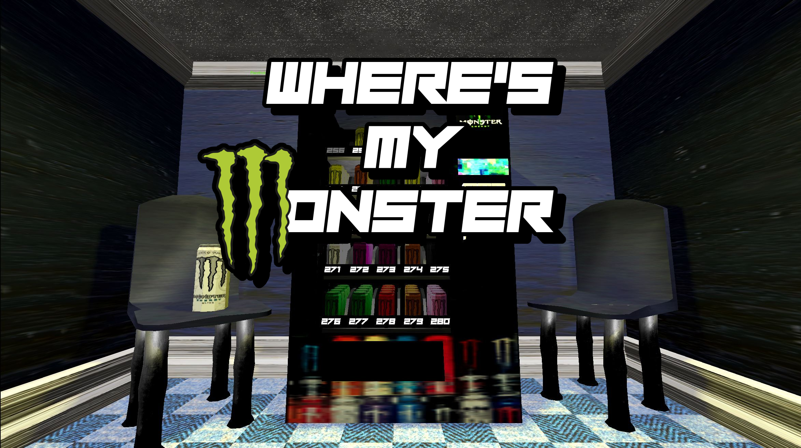
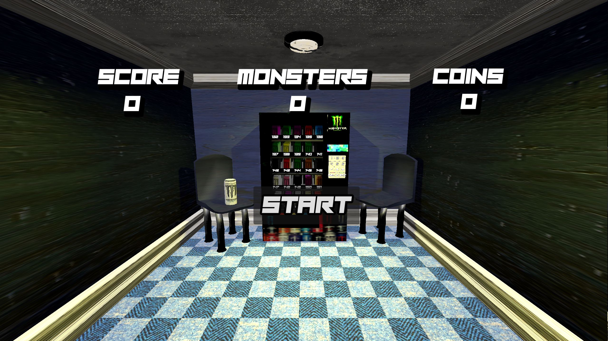
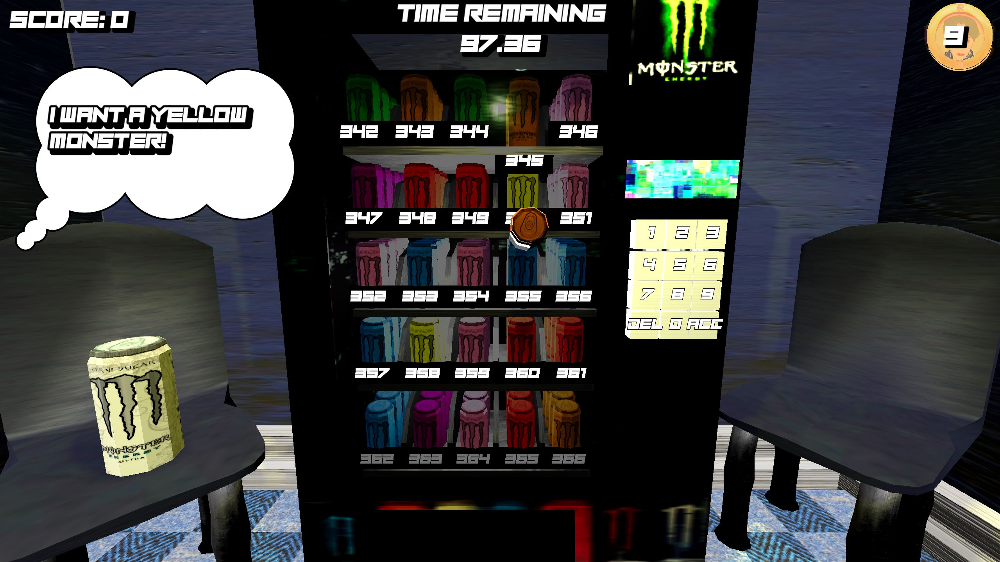
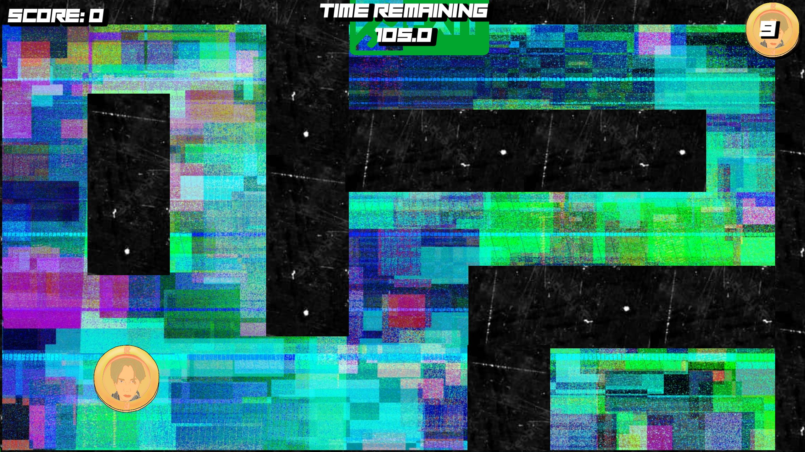

# Project Title

Include for each contributer:

Name: Scott

Student Number:  A00033224

Class Group: TU984


# Video

[](https://youtu.be/k1n3TPAd9bM?si=3BMkchFsWIXRLfMq)

# Screenshots
Titlescreen Image

3D Gameplay Image

2D Gameplay Image


# Description of the project
A Game for the Creative Coding 2026 Day In A College Students Life Assignment.
A Monster themed game where you must fish out as many monsters from a vending machine in a set amount of time. 
It is a chaotic arcate themed game that simulates a students life choices surrounding their precious Monster Energy!

# Instructions for use
Run the Game from the web browser on [Itch](https://auesip.itch.io/wheres-my-monster_).
Collect As Many Monsters As You Can!
Left Click to Interact
Left Click To Move the coin!
A and D to SHAKE THE MACHINE

# How it works:
Where's My Monster utilises Instantiation, Abstraction and Parameter Based Procedural Generation for its gameplay loops to function.

Core Loop
- Interact with keypad
- Activate 2D Minigame
- Monster falls
- Collect Score + Monster

External Feedback Loops 1
- Monster Gets stuck
- Player must shake A and D Keys to unstuck it
- Monster Falls
  
External Feedback Loops 2
- Player Requests Specific Monster
- Player Collects Requested Monster
- Background Score Multiplier Increases


# List of classes/assets in the project

| Class/asset | Source | Use |
|-----------|-----------|-----------|
| GlobalVars.gd | Self written | Stores Hi-Score |
| vending_game_manager.gd | Self written | Communicator For All Scripts |
| SoundHandler.gd | Self written | Alters Audio Pitch Randomly |
| 2d_minigame.gd | Self written | Manages 2D Scene |
| end_screen.gd | Self written | Handles The End Screen UI |
| front_piece.gd | Self written | Animations For Opening Slots |
| Minigame_Coin.gd | Self written | Coin Collision Handler |
| monster_can.gd | Self written | Monster Can Initialisation |
| physical_button.gd | Self written | Keypad Button Handler |
| playerScript.gd | Self written | Player Input Handler |
| start_screen.gd | Self written | Handles The Titlescreen UI |
| vending_slot.gd | Self written | Holds and Generates Monster Cans |
| WallScript.gd | Self written | Randomisation Of 2D Scene |

# What I am most proud of in the assignment
- Scott Fowler
Design and Visual Cohesion. The Game is wrapped up nicely as a complete package with a core gameplay loop and two external motivation loops that compliment it.
The visual effects and sound design using custom made sounds lead to a satisfying finish to the game.

# What I learned
Instantiation and Procedural features go hand in hand. With these two tricks utilised I was able to generate random variants of the game on "Start" instead of hard-coding any specific elements.

# Code Examples

##GlobalVars
```GDScript
extends Node

class_name GlobalVars

var score:int
var coins:int
var MonstersCollected:int

func SetCoins(coin:int):
	coins = coin
```

##vending_game_manager
```GDScript
func _process(delta: float) -> void:
	if (titleScreen):
		return
	time -= delta
	UpdateTimeText(time)
#initiates a random request	
func InitiateRequest():
	requestColor = requestList.pick_random()
	var formatString = "I Want A %s Monster!"
	$CanvasLayer/Request.text = formatString % requestColor
#UI handlers	
func UpdateLabelText():
	label.text = labelNumber
#UI handlers	
func UpdateTimeText(time:float):
	$CanvasLayer/TimeCount.text = str(snappedf((time),0.01))
	if (time <= 0):
		HandleEnd()
#UI handlers			
func UpdateCoinCount(coins:int):
	coinCount = coins
	if (coinCount <= 0):
		HandleEnd()
	$CanvasLayer/CoinCount.text = str(coinCount)
#Input Button handler
func ButtonPressed(buttonVal:String):
	match buttonVal:
		"DEL":
			RemoveNumberFromLabel()
		"ACC":
			CheckMatchingCanNumber()
		_:
			UpdateLabelValue(buttonVal)
```

##SoundHandler
```GDScript
extends AudioStreamPlayer3D

func _on_finished() -> void:
	pitch_scale = randf_range(0.9,1.1)
```

##2d_minigame
```GDScript
func init(sceneScript:Node3D):
#reference to vending_game_manager
	globalScript = sceneScript

func OnCompleteMinigame(won:bool):
	globalScript.HandleMinigameCompletion(won)

func _on_coin_death() -> void:
	print("DIED")
	OnCompleteMinigame(false)
	queue_free()
	
func _on_coin_won() -> void:
	print("WON")
	OnCompleteMinigame(true)
	queue_free()

func _on_tree_entered() -> void:
	minigameList.pick_random().visible = true
```

##end_screen
```GDScript
extends Node2D

func _ready() -> void:
	$CanvasLayer/ScoreCount.text = str(GV.score)
	$CanvasLayer/MonsterCount.text = str(GV.MonstersCollected)
	$CanvasLayer/CoinCount.text = str(GV.coins)

func _on_button_pressed() -> void:
	get_tree().change_scene_to_file("res://Scenes/StartScreen.tscn")
```

##front_piece
```GDScript
#Animated Piece
func InitiateGoDown():
	$"../SlideSFX".play()
	if currentTimes > PositionNodes.size():
		currentTimes = 0
	currentTimes = currentTimes + 1
	print("Times Used " + str(currentTimes))
	var tween = create_tween()
	tween.tween_property(self, "position",UpDown[1].position , 1)
	tween.tween_callback(self.PushSlotForward)
	$StaticBody3D/CollisionShape3D.disabled = true

func PushSlotForward():
	var tween = create_tween()
	tween.tween_property(PushPiece, "position",PositionNodes[currentTimes].position , 0.6)
	tween.tween_callback(self.PushSlotBackward)
	
func PushSlotBackward():
	$"../SlideSFX".play()
	var tween = create_tween()
	tween.tween_property(PushPiece, "position",PositionNodes[currentTimes-1].position , 1)
	#increases distance for next time
	tween.tween_callback(self.InitiateGoUp)
	$StaticBody3D/CollisionShape3D.disabled = false
	
func InitiateGoUp():
	var tween = create_tween()
	tween.tween_property(self, "position",UpDown[0].position , 1)
```

##Minigame_Coin
```GDScript
func _on_collision_box_input_event(viewport: Node, event: InputEvent, shape_idx: int) -> void:
	if Input.is_action_pressed("leftClick"):
		global_position = get_viewport().get_mouse_position()

func _on_deathy_area_area_entered(area: Area2D) -> void:
	if area.is_in_group("DeathWall"):
		emit_signal("Death")
	if area.is_in_group("WinZone"):
		emit_signal("Won")
```

##monster_can
```GDScript
#abstract editable monster can
extends Node3D
@onready var monsterCan = $RigidBody3D/MonsterCan/Cylinder
var MonsterColour :Color 
var MonsterColourName:String
# Called when the node enters the scene tree for the first time.
func _ready() -> void:
	pass

func init(newColor:Color,newName:String) -> void:
	#changes the material accordingly
	MonsterColour = newColor
	MonsterColourName = newName
	var material = monsterCan.get_surface_override_material(0).duplicate()
	material.albedo_color = MonsterColour
	monsterCan.set_surface_override_material(0, material)
	
func ReturnMonsterColourName() -> String:
	return MonsterColourName
```

##physical_button
```GDScript
func _ready() -> void:
	$Label3D.text = buttonVal
	originalPosition = this.position

func returnButtonValue() -> String:
	var tween = create_tween()
	tween.tween_property(this, "position",Vector3(originalPosition[0],originalPosition[1],originalPosition[2] + 0.25) , 0.05)
	tween.tween_property(this, "position",Vector3(originalPosition[0],originalPosition[1],originalPosition[2]) , 0.05)
	return buttonVal
	
func _on_area_3d_area_entered(area: Area3D) -> void:
	print(returnButtonValue())
```

##playerScript
```GDScript
func _input(event: InputEvent) -> void:
	if event.is_action_pressed("leftClick"):
		var space_state = get_world_3d().direct_space_state
		var cam = self
		var mousepos = get_viewport().get_mouse_position()
		var origin = cam.project_ray_origin(mousepos)
		var end = origin + cam.project_ray_normal(mousepos) * length
		var query = PhysicsRayQueryParameters3D.create(origin, end)
		query.collide_with_areas = true
		var result = space_state.intersect_ray(query)
		
		if result:
			var final = result.collider.get_parent()
			print(final)
			if !final.is_in_group("InputButtonGroup"):
				return
			mainScript.ButtonPressed(final.returnButtonValue())
```

##start_screen
```GDScript
func _ready() -> void:
	pass # Replace with function body.
	$CanvasLayer/ScoreCount.text = str(GV.score)
	$CanvasLayer/MonsterCount.text = str(GV.MonstersCollected)
	$CanvasLayer/CoinCount.text = str(GV.coins)

func _on_button_pressed() -> void:
	get_tree().change_scene_to_file("res://Scenes/vending_scene.tscn")
```

##vending_slot
```GDScript
var monsterColour:Color
var monsterColourName:String
@onready var listOfSlots = [$Slot1,$Slot2,$Slot3,$Slot4]
@onready var numberText = $FrontPiece/Label3D
func _ready() -> void:
	pass # Replace with function body.

func init(mColourName:String,mColour:Color, numberForSlot):
	monsterColour = mColour
	monsterColourName = mColourName
	numberForThisSlot = numberForSlot
	randomStuckChance = randf()
	
	for slot in listOfSlots:
		var monster = MonsterScene.instantiate()
		add_child(monster)
		monster.transform = slot.transform
		monster.init(monsterColour,monsterColourName)
	
	numberText.text = str(numberForThisSlot)
	
func ReturnNumberForSlot() -> int:
	return numberForThisSlot

func InitiateVendingPush() -> void:
	#Initiates Tween Motion
	$FrontPiece.InitiateGoDown()
	
func ReturnIsStuck() -> bool:
	var out = randf() <= randomStuckChance
	print(out)
	return out
```

##WallScript
```GDScript
func _on_visibility_changed() -> void:
	disabled = !visible
```

